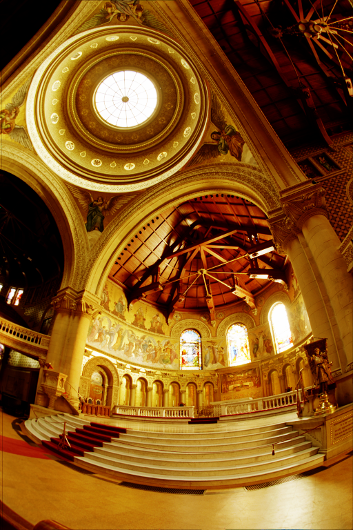
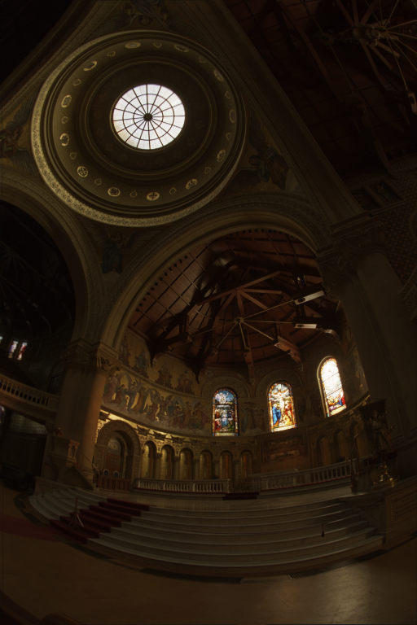

# PhotoGENius - _Your wish, my duty_
### Photorealistic images generation

 

<!-- add here a funny but explanatory image, maybe one of a genius! -->

## Features

In its second release, PhotoGENius can:
- read a PFM file and convert it to a PNG file, given an output luminosity parameter `alpha` and a calibration factor `gamma`.
- generate demonstrative scene in both PNG and PFM format, given a set of options, including view angle.
- assemble different frames to generate a simple animation.

## Usage
Easy to use: go to PhotoGENius\PhotoGENius directory.

To **convert file**, type
```bash
dotnet run PhotoGENius pfm2png --input-pfm PFM_FILE_PATH_NAME <options>
```
Pay attention that if your computer is set on Italian language, you may need to write floating-point parameters with a comma instead of a dot (e.g. 1,3 instead of 1.3).

To **generate demo image**, type
```bash
dotnet run PhotoGENius demo <options>
```
Type anything as option to show further usage information.\
Demo code can be adapted quite easily to change spheres disposition
in the scene.

## Examples

### PFM to PGN convertion
Alpha=10 and gamma=0.1 : 
```bash
dotnet run PhotoGENius pfm2png --input-pfm memorial.pfm --factor 10 --gamma 0.1 --output-png prova1.png
 ```


Alpha=0.01 and gamma=2 : 
```bash
dotnet run PhotoGENius pfm2png --input-pfm memorial.pfm --factor 0.01 --gamma 2 --output-png prova2.png
 ```


### Generate a brief animation

To **generate frames**, type
```bash
./generate-frames.sh
```
You can easily adapt the script to your needs and make it executable (chmod +x on Linux and MacOS).

To **assemble video**, after installing [ffmpeg](https://www.ffmpeg.org/download.html), type
```bash
./generate-video.sh
```
This is the result with 90 frames at angles from 0° to 89°:


## Full documentation
See the [UserManual](UserManual).

## Requirements
PhotoGENius can be used on Windows, Linux and MacOS systems.\
It requires dotnet 6.0 to run.\
To assemble generated frames in a mp4 video via out script (generate-video.sh) you need 
to install ffmpeg (for example in the same directory as dotnet).

## Installation

## Licence
GPU3.

Read the whole licence [here](LICENCE).
